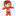

#  mod_league

Copyright 2018 Miguel Romeral (Universidad de Alcalá)

*También puedes leer esto en otros idiomas: [English](README.md), [Spanish](README.es.md)*

Módulo de actividad para Moodle que consiste en una liga en la que los alumnos pueden competir entre sí y llegar a lo más alto de la clasificación con sus calificaciones.

## Descripción

## Requisitos

## Motivación

## Instalación

## Fincionalidades y capturas

## Pruebas

## TODO

## Contacto

## Licencia

Licencia Pública General GNU 3.0
