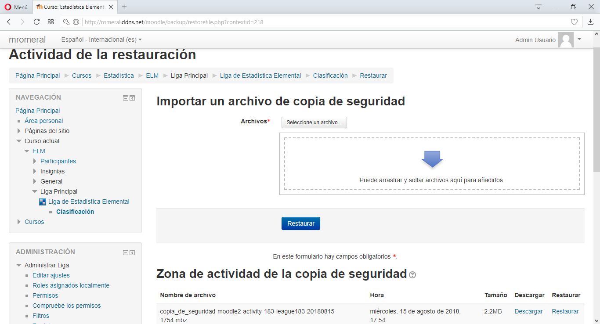

#  mod_league

[](https://www.gnu.org/licenses/gpl-3.0)

Copyright 2018 Miguel Romeral [Universidad de Alcalá](https://www.uah.es)

*También puedes leer esto en otros idiomas: [English](README.md), [Español](README.es.md)*

Módulo de actividad para Moodle que consiste en una liga en la que los alumnos pueden competir entre sí y llegar a lo más alto de la clasificación mediante las calificaciones a sus trabajos.

## Descripción

Este módulo consiste en una actividad que organiza los trabajos de los alumnos en función de la nota que se les asigne en forma de clasificación con el fin de fomentar la competencia entre estudiantes y el interés por el curso, los ejercicios a entregar y el contenido de la asignatura.

Una liga está compuesta por ejercicios que el administrador del curso (generalmente el profesor, administrador del sitio o un rol similar) va creando durante el curso.
Cada ejercicio está compuesto por un breve enunciado seguido de una profusa descripción, con el fin de indicar a los alumnos los criterios de corrección por cada ejercicio.
Los estudiantes pueden entonces mandar su tarea en ficheros para que el profesor pueda descargarlos y, en función de los criterios de corrección del ejercicio, calificarle de una determinada manera. Estas calificaciones se organizarán en una tabla con la clasificación general en cuanto a notas que los alumnos pueden ver en cualquier instante (manteniendo privacidad sobre las calificaciones de los demás alumnos).

La privacidad en la clasificación consiste en que los profesores tienen acceso a cualquier dato de los trabajos de los estudiantes mientras que éstos únicamente podrán ver los datos de sus propios trabajos, además sólo podrán ver la nota global de los demás usuarios y sus nombres están ocultos mediante una función hash, de esta manera se consigue privacidad entre los diferentes estudiantes.

## Motivación

Este proyecto consiste en el Trabajo, **actualmente en desarrollo**, de Fin de Grado de Miguel Ángel García Romeral con la supervisión del [Profesor Antonio García Cabot](https://www.uah.es/es/estudios/profesor/Antonio-Garcia-Cabot/), de la [Universidad de Alcalá](https://www.uah.es) .

## Requisitos

* Versión de Moodle 3.1.12 o superior.
* Versión de PHP 5.3 o superior.

## Instalación

1. Descargue el repositorio desde el botón *Clone or download* --> *Download ZIP* o clone el proyecto mediante la siguiente orden:

    ```
    git clone https://github.com/miguelromeral/moodle-mod_league.git
    ```

2. Cree un subdirectorio llamado ```league``` dentro del directorio ```(DIRECTORIO_MOODLE)/mod/``` y copie los ficheros descargados dentro. Normalmente ```(DIRECTORIO_MOODLE)``` se suele encontrar en ```/var/www/html/moodle```, aunque depende de cada servidor.

3. Inicie sesión como *Administrador* en su sitio Moodle y acceda a *Administración del sitio* -> *Notificaciones*.

4. Si todo fue correcto, aparecerá en pantalla un solicitando atención (será nuestra *Liga* lista para instalarse). Pulsar sobre *Actualizar base de datos Moodle ahora*.

5. Una vez finalizado, puede pulsar en *Continuar* y a partir de entonces puede crear instancias del plugin en cualquier curso (a través de *Activar edición*).

## Funcionalidades: vídeo

Puede ver este [vídeo](https://vimeo.com/289471436) en el que se muestran las principales funcionalidades del plugin en español.

## Funcionalidades: capturas

* ### Crear ejercicios que compongan la liga


* ### Los estudiantes pueden subir sus intentos para los ejercicios


* ### Corregir los trabajos (o intentos) de los estudiantes


* ### Visualizar clasificación en tiempo real y como estudiante

    * #### En tiempo real (contando las notas aún sin publicar)

       

    * #### Vista como estudiante (contando únicamente las notas publicadas)

       

* ### Los estudiantes pueden ver la clasificación con los nombres ocultos


* ### Comparación de notas individuales


* ### Registro de eventos


* ### Edición de permisos para diferentes roles


* ### Soporte para backup y restauración





## Pruebas

Se han realizado pruebas unitarias mediante PHPUnit de manera satisfactoria.

    root@server:/var/www/html/moodle# vendor/bin/phpunit --group mod_league
    Moodle 3.1.12+ (Build: 20180524)
    Php: 5.5.9.1.4.25, mysqli: 5.5.60-0ubuntu0.14.04.1, OS: Linux 4.4.0-128-generic i686
    PHPUnit 4.8.27 by Sebastian Bergmann and contributors.

    .........................

    Time: 5.27 minutes, Memory: 152.75MB

    OK (25 tests, 112 assertions)

## Manual de usuario

Existe un [manual de usuario en español](manuals/es.pdf) orientado a todos los usuarios de Moodle, tanto alumnos como profesores o administradores del sitio.

## Detalles de la versión

### v1.0 (ALPHA)

* Primera versión del plugin, añadidas las funcionalidades básicas.

## TODO

* Sincronizar ejercicios con Calendar API y poner fecha límite a los mismos (desactivación automática).
* Configurar plugin para que solo admita determinados tipos de ficheros.

## Contacto

Puede enviar sus comentarios, sugerencias o informar de un error a través de los siguientes enlaces de contacto.

Correo electrónico: miguelangel.garciar@edu.uah.es

LinkedIn: Miguel Romeral (https://www.linkedin.com/in/miguelromeral/)

Twitter: @MiguelRomeral (https://twitter.com/MiguelRomeral)

## Licencia

Licencia de Moodle: Moodle is provided freely as open source software, under the GNU General Public License <https://docs.moodle.org/dev/License>.