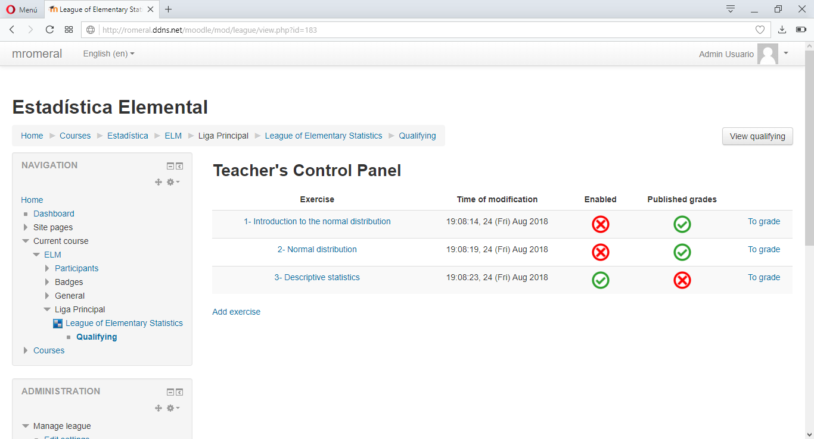
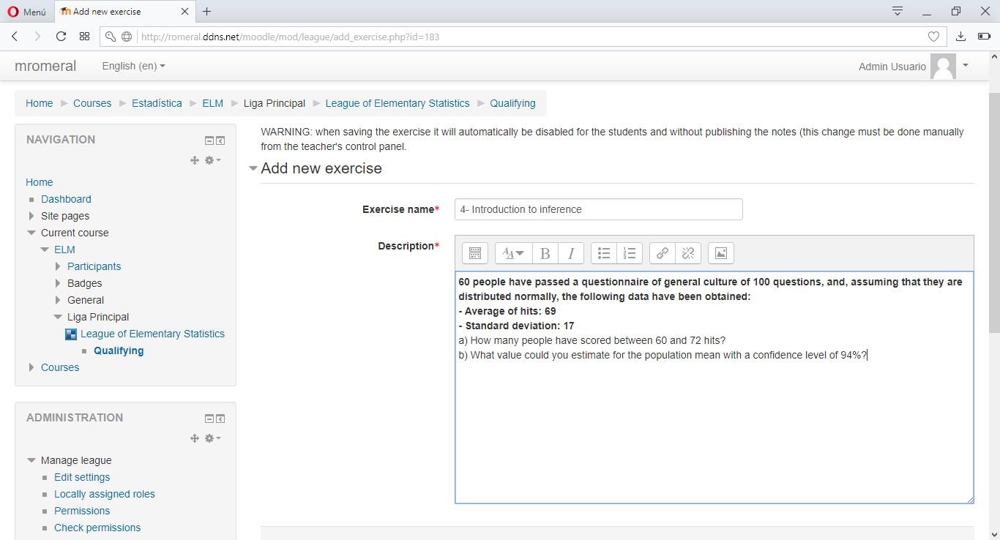

#  mod_league

Copyright 2018 Miguel Romeral [Universidad de Alcalá](https://www.uah.es)

*You can also read this paper in other languages: [English](README.md), [Español](README.es.md)*

Moodle activity module that consists of a league in which students can compete with each other and reach the top of the leaderboard by grading their work.

## Description

This module consists of an activity that organizes the work of the students according to the grade assigned to them in form of classification in order to encourage the competition between students and the interest in the course, the exercises to be delivered and the contents of the subject.

A league is composed of exercises that the administrator of the course (usually the teacher, administrator of the site or a similar role) is creating during the course.
Each exercise is composed of a brief statement followed by a profuse description, in order to indicate to the students the criteria of correction for each exercise.
Students can then send their task in files in order to the teacher could download them and, depending on the criteria of correction of the exercise, grading in a certain way. These grades will be organized in a table with the general classification in terms of grades that the students can see at any moment (keeping privacy on the qualifications of the other students).

The privacy in the classification consists of the teachers have access to any data of the work of the students while they will only be able to see the data of their own works, besides they can only see the global note of the other users and their names are hidden by a hash function, this way you get privacy between the different students.

## Motivation

This project consists of the Miguel Ángel García Romeral’s Dissertation, **currently being developed**, with the supervisión of the [Teacher Antonio García Cabot](https://www.uah.es/en/estudios/profesor/Antonio-Garcia-Cabot/), from [University of Alcalá](https://www.uah.es/en/) .


## Requirements

* Moodle 3.1.12 version or higher.
* PHP 5.3 version or higher.

## Installation

1. Download the repository from the button *Clone or download* --> *Download ZIP* or clone the project using the following command:

    ```
    git clone https://github.com/miguelromeral/moodle-mod_league.git
    ```

2. Create a subdirectory called ```league``` within the directory ```(MOODLEDIR)/mod/``` and copy the downloaded files into. Usually ```(MOODLEDIR)``` is found in ```/var/www/html/moodle```, although it depends on each server.

3. Log in as *Administrator* on your Moodle site and Access to *Site Administration* -> *Notifications*.

4. If all was correct, a requesting attention will appear on the screen (it will be our *League* ready to install). Click on *Update Moodle database now*.

5. When it had finished, you can click on *Continue* and from then on you can create plugin instances in any course (via *Turn editing on*).

## Features: video

You can watch this [video](https://vimeo.com/289471436) in which the main features of the plugin are shown, however, its strings are in spanish.

## Features: screenshots

* ### Create League exercises





* ### Students can upload their attempted exercises


* ### Mark work (or attempts) of students


* ### Display classification in real time and as a student

    * #### Live (Counting the non-published notes yet)

       

    * #### View as a student (Counting only the published notes)

       

* ### Students can see the ranking with the hidden names


* ### Compare individual notes


* ### Event log


* ### Edit permissions for different roles


* ### Backup and restore support


## Tests

Unit tests have been carried out using PHPUnit successfully.

    root@server:/var/www/html/moodle# vendor/bin/phpunit --group mod_league
    Moodle 3.1.12+ (Build: 20180524)
    Php: 5.5.9.1.4.25, mysqli: 5.5.60-0ubuntu0.14.04.1, OS: Linux 4.4.0-128-generic i686
    PHPUnit 4.8.27 by Sebastian Bergmann and contributors.

    .........................

    Time: 5.27 minutes, Memory: 152.75MB

    OK (25 tests, 112 assertions)

## User manual

There is a [user manual in English](manuals/en.pdf) aimed at all Moodle users, both students and teachers or site administrators.

## TODO

* Synchronize exercises with Calendar API and set deadline to them (auto-disable).
* Configure plugin to only support certain types of files.

## Contact

You can send your comments, suggestions or report an error through the following contact links.

E-mail: miguelangel.garciar@edu.uah.es

LinkedIn: Miguel Romeral (https://www.linkedin.com/in/miguelromeral/)

Twitter: @MiguelRomeral (https://twitter.com/MiguelRomeral)

## Moodle License

Moodle License: Moodle is provided freely as open source software, under the GNU General Public License <https://docs.moodle.org/dev/License>.

